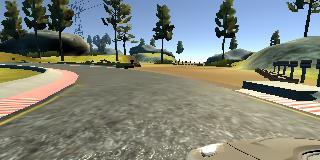
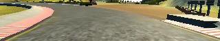
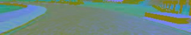

# CarND-BehavioralCloning

The goal of this project is to train a neural network to successfully 
predict steering angles for a car (and as a consequence, drive within
the boundaries of a track). 

## Collecting data

While experimenting with data collection, it quickly became apparent  
that having good data to feed to the network was paramount. Using a keyboard  
to drive in the simulator generated useless data. Data acquired 
with a joystick proved slightly better - steering angles are smoother and 
driving resembled more of what we would expect from a human. Collecting 
data for recovery, though, proved to be too burdensome. In the end, data 
provided by Udacity was more reliable than data generated by myself -  
maybe I'm not a good gamer :)

I decided to stick with Udacity's data and that was sufficient to obtain 
good results.

## Image pre-processing

The second step was to decide how to pre-process images acquired from 
the simulator. My first decision was to crop the images. This serves two 
purposes:

1. A good part of the image is irrelevant for prediciting the steering angle. 
The top does not show the road ahead, the bottom shows the steering wheel. 
Removing information that's irrelevant to the problem would make the training 
converge faster.
2. Smaller inputs mean faster training.

I also wanted to use a different color space - from the lane finding project 
it was clear that having a separate brightness channel could be beneficial. 
This would also allow me to do some image augmentation by adjusting the  
brightness of the input image. My goal was to get something that would be 
robust enough to drive in the second track with no need for additional 
training data.

After some experiments with HSV and YUV I ended up deciding to use YUV.

I also did some experiment with blurring, equalization and intensity 
rescaling. To my surprise, blurring affected the results negatively. 
Sometimes, blurring could "erase" some interesting features of the image  
that proved to be fundamental for a successful driving in the second track. 
Equalizing the luminance channel didn't produce any meaningful result. 
Intensity rescaling, however, was very beneficial as it greatly 
increased robustness to light and contrast.

My final goal for image pre-processing was to speed up training. Since 
I had a fixed set of images that I would iterate over every epoch, I 
could save cropped, intensity rescaled, YUV versions of these images to 
disk and avoid applying the same operations over and over during training.

Original image:

Cropped image:

Intensity rescaled:

YUV as BGR (Y is the blue channel):

## The model

I decided to first research what others had done to approach the same 
problem instead of reinventing the wheel here. Two models seemed to be 
very popular:

1. Nvidia - http://images.nvidia.com/content/tegra/automotive/images/2016/solutions/pdf/end-to-end-dl-using-px.pdf
2. Comma.ai - https://github.com/commaai/research/blob/master/train_steering_model.py

I believe both are good enough to tackle the problem but since Nvidia's model 
delivered better initial results, I stuck with it. After experimenting a 
little bit more, I noticed that I could do with a simpler network and  
removed one of the convolutional layers. I have also added a normalization 
layer on the very start of the network to keep image values between [-1, 1].

Nvidia's paper makes no mention of use of dropout layers nor what kind of 
activation was used. I decided two add two dropout layers and use ReLU. 

The final model looks like this:

| Layer (type)                   | Kernel     | Stride     | Activation   | Output Shape      |                     
|--------------------------------|:----------:|:----------:|:------------:|-------------------|
|lambda_1 (Lambda)               | N/A        | N/A        | N/A          |(None, 60, 320, 3) |             
|convolution2d_1 (Convolution2D) | 5x5        | 2x2        | ReLU         |(None, 30, 160, 24)|                   
|convolution2d_2 (Convolution2D) | 5x5        | 2x2        | ReLU         |(None, 15, 80, 36) |            
|convolution2d_3 (Convolution2D) | 5x5        | 2x2        | ReLU         |(None, 8, 40, 48)  |            
|convolution2d_4 (Convolution2D) | 3x3        | 1x1        | ReLU         |(None, 8, 40, 64)  |            
|flatten_1 (Flatten)             | N/A        | N/A        | N/A          |(None, 20480)      |            
|dense_1 (Dense)                 | N/A        | N/A        | N/A          |(None, 1164)       |                  
|dropout_1 (Dropout 0.5)         | N/A        | N/A        | ReLU         |(None, 1164)       |                                     
|dense_2 (Dense)                 | N/A        | N/A        | N/A          |(None, 100)        |               
|dropout_2 (Dropout 0.2)         | N/A        | N/A        | ReLU         |(None, 100)        |                    
|dense_3 (Dense)                 | N/A        | N/A        | ReLU         |(None, 50)         |               
|dense_4 (Dense)                 | N/A        | N/A        | ReLU         |(None, 10)         |               
|dense_5 (Dense)                 | N/A        | N/A        | N/A             |(None, 1)          |               

### Augmenting data

Udacity's data is not very extensive (we have 8036 CSV entries in total). If 
we take a chunk to be our validation set, it gets even smaller. On top of 
that, we only have data for the first track in the data set. To deal with 
this, I did three things:

1. I randomly adjusted image brightness for every training sample. The 
rationale is that this would help generalizing the model.

2. I also wanted to make use of the left and right cameras and use this 
as "recovery" data, as described in Nvidia's paper. I did several experiments 
with steering angle adjust values to find the balance between over and 
under correcting. In the end I decided to use the following formula:

    * left_img_angle = angle + 0.27 + (angle * 0.2)
    * right_img_angle = angle - 0.27 - (angle * 0.2)

3. Flipping images is an easy way to augment data. Despite wanting to have 
a strong recovery response, I didn't want to over represent steering 
scenarios, so I decided to flip only the center camera image.
  
The batch generator randomly selects whether to use the center, left, 
right or flipped center image. For the selected image, random brightness 
adjust is then applied.

### Training

To guarantee I wasn't overfitting, I used 20% of the training data as  
validation. After a few tests, 25 epochs looked like a good compromise 
between training and validation loss. Given that the heavy part of 
image processing was done beforehand, I managed to train the whole model 
in a little more than 2 minutes (~5s per epoch).

## Final considerations

The model is capable of driving with no issues through both tracks. It 
was necessary to adjust the throttle to do so (the second track has very 
steep hills and very sharp curves). The throttle is a product of the 
current speed and the predicted angle. This could be further improved by 
using a non-linear model (but is out of scope for this project). 

It is also interesting that we can successfully navigate the first 
track (with a lot of uncertainty) even with the simulator in the highest  
image quality setting. This setting adds a lot of shadows in the track 
for which the model was not trained (all data came from the lowest 
resolution mode). 